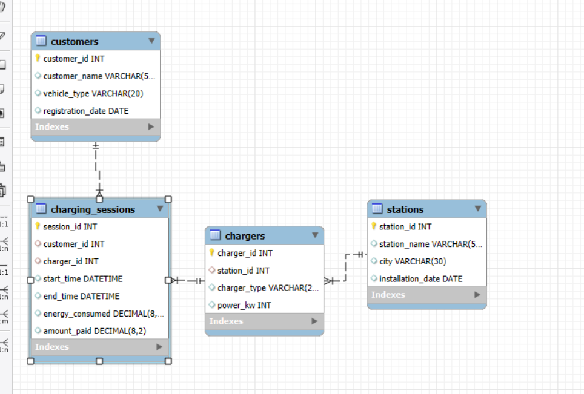
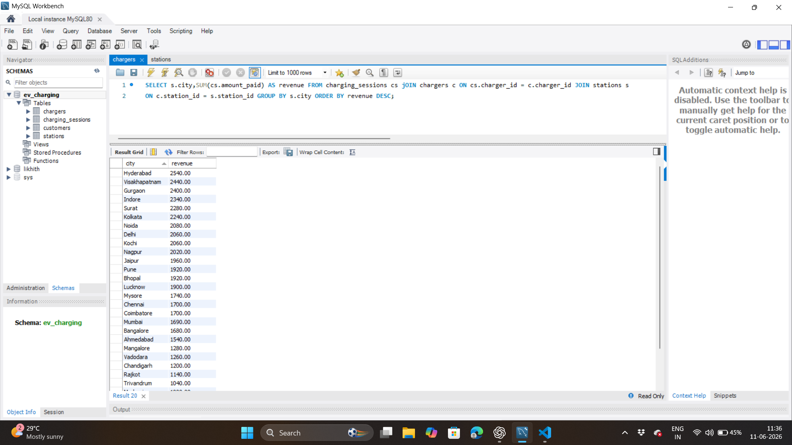
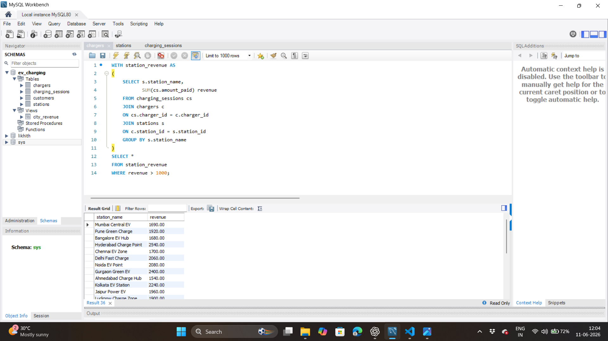
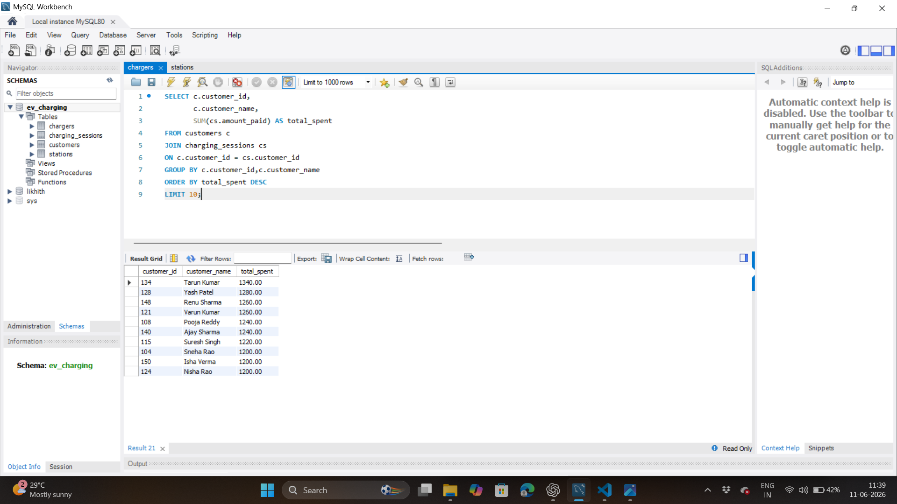
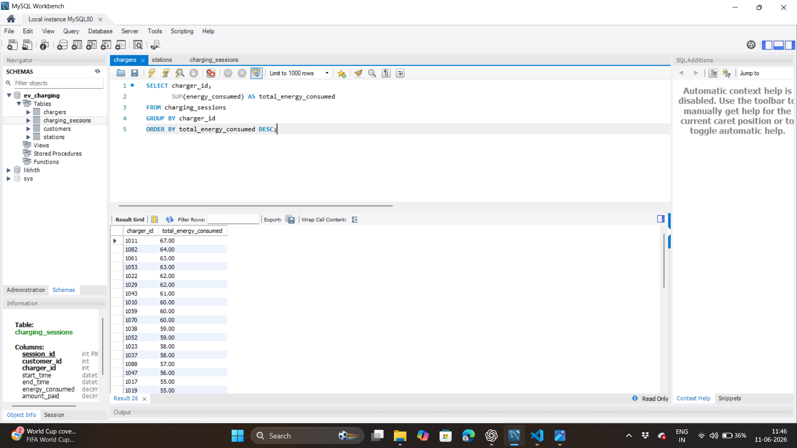
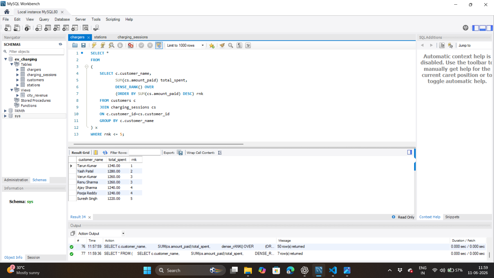

# EV Charging Analytics System

## Entity Relationship Diagram

## Project Overview

This project analyzes EV charging station performance across multiple cities.

## Revenue by City

## Revenue by station

## Top Customers

## Peak Charging Hours

## Total energy consumed by station

## Top 5 customers

## Project Overview

This project analyzes EV charging station performance across multiple cities.

## Database Tables

- Stations
- Customers
- Chargers
- Charging Sessions

## SQL Concepts Used

- Joins
- Aggregate Functions
- Window Functions
- CTEs
- Views
- Stored Procedures
- Indexes