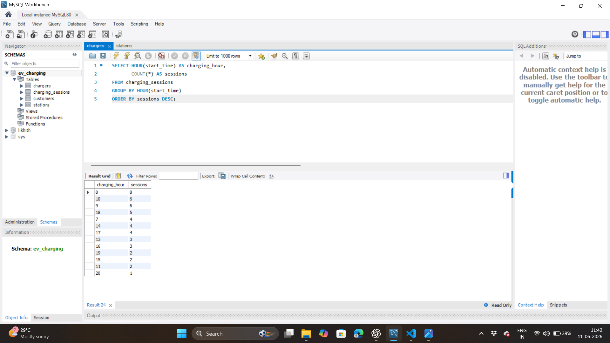

# ⚡ EV Charging Analytics System (SQL Data Engineering Project)

## 📊 Project Overview

The EV Charging Analytics System is a real-world inspired SQL analytics project designed to analyze electric vehicle charging station performance across multiple cities.

It transforms raw charging session data into meaningful business insights such as revenue trends, customer behavior, energy consumption patterns, and operational efficiency of charging stations.

This project demonstrates strong SQL data analysis capabilities using advanced querying techniques.

---

## 🎯 Business Objectives

- Analyze revenue performance across cities and stations  
- Identify high-value customers and spending patterns  
- Detect peak charging demand hours for capacity planning  
- Evaluate charger utilization efficiency  
- Measure total energy consumption per station  
- Understand customer usage behavior and loyalty patterns  

---

## 📈 Key Business Insights

- Top revenue-generating cities in EV charging network  
- Station-wise revenue contribution analysis  
- High-value customers based on total spending  
- Peak charging hours identification for demand optimization  
- Most utilized charging stations and chargers  
- Energy consumption trends across stations  

---

## 🗺️ Entity Relationship Diagram

---

## 🏙️ Revenue Analysis

### Revenue by City

### Revenue by Station

---

## 🧑‍💼 Customer Analytics

### Top Customers

### Top 5 Customers

---

## ⏰ Operational Analysis

### Peak Charging Hours

---

## ⚡ Energy Analysis

### Total Energy Consumed by Station

---

## 🗃️ Database Schema

The database consists of the following tables:

- **Stations** → Stores EV charging station details  
- **Customers** → Stores customer and vehicle information  
- **Chargers** → Stores charger specifications and station mapping  
- **Charging Sessions** → Stores transaction-level charging data  

---

## 🧠 SQL Concepts Used

- Advanced JOIN operations  
- Aggregate functions (SUM, COUNT, AVG)  
- Window functions (RANK, DENSE_RANK)  
- Common Table Expressions (CTEs)  
- Views for reusable analytics  
- Stored Procedures for automation  
- Indexing for performance optimization  

---

## 🏆 Project Highlights

- End-to-end SQL analytics pipeline  
- Real-world EV charging domain simulation  
- Business-focused KPI generation  
- Optimized relational database design  
- Portfolio-ready data analytics project  

---

## 👨‍💻 Tools Used

- MySQL  
- VS Code  
- GitHub  
- SQL (Advanced Querying Techniques)  

---

## 📌 Author

LikhithkumarD — Data Analytics Portfolio Project